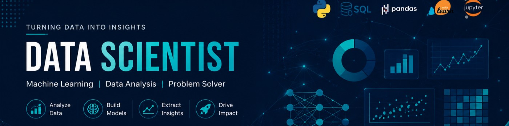

<!-- ========================================================= -->
<!--                  ANVESH JAIN • README                    -->
<!-- ========================================================= -->

<!-- ======================= HERO ============================ -->

  

 

  

  
  
  

 

---

# 🌌 About Me

<table>
<tr>

<td width="62%" valign="top">

<h2>👋 Hey, I'm Anvesh!</h2>

I'm an <b>MCA candidate</b> building my career around
<b>Data Analytics, Data Science and Machine Learning</b>.

I enjoy turning raw datasets into meaningful insights through
<b>Python, Pandas, NumPy, SQL, Statistics, EDA and Data Visualization</b>.

My development background includes
<b>React.js, Next.js and web application development</b>,
which gives me an additional software-engineering perspective
when building data-driven applications.

 

<h3>🎯 Career Direction</h3>

&nbsp; ➜ &nbsp;

&nbsp; ➜ &nbsp;

&nbsp; ➜ &nbsp;

</td>

<td width="38%" align="center">

  

 
⬇
 

 
⬇
 

 
⬇
 

</td>

</tr>
</table>

---

# 🧠 My Skill Journey

<table>
<tr>

<!-- ================= LEARNED ================= -->

<td width="33%" valign="top" align="center">

<h2>🟢 Learned</h2>

  

 

<b>Python • NumPy • Pandas</b>

  

 

EDA • Data Cleaning 
Data Visualization 
Statistics Fundamentals

  

 

SQL • MySQL • Data Integration

  

</td>

<!-- ================= CURRENT ================= -->

<td width="33%" valign="top" align="center">

<h2>🟡 Learning</h2>

  

 

Regression • Classification 
Clustering • Feature Engineering 
Model Evaluation

  

 

Text Preprocessing 
Tokenization • Feature Extraction 
Text Classification

  

</td>

<!-- ================= FUTURE ================= -->

<td width="33%" valign="top" align="center">

<h2>🔵 Future</h2>

  

 

Neural Networks • ANN 
CNN • RNN

  

 

LLMs • Prompt Engineering 
Embeddings • Vector Databases

  

 

RAG • LangChain 
Semantic Search • AI Applications

</td>

</tr>
</table>

---

# 🛠️ Technical Skills

## 🐍 Programming & Data

  

---

## 📊 Data Analytics & Visualization

---

## 🤖 Machine Learning

---

## 🌐 Development

---

# 🗺️ Data Science Roadmap

 

<table align="center">

<tr>

<td align="center">

  

<b>Python</b>

 

🟢 DONE

</td>

<td>➜</td>

<td align="center">

  

<b>NumPy</b>

 

🟢 DONE

</td>

<td>➜</td>

<td align="center">

  

<b>Pandas</b>

 

🟢 DONE

</td>

<td>➜</td>

<td align="center">

📊

  

<b>EDA</b>

 

🟢 DONE

</td>

<td>➜</td>

<td align="center">

📈

  

<b>Visualization</b>

 

🟢 DONE

</td>

</tr>

</table>

 

<table align="center">

<tr>

<td align="center">

📐

  

<b>Statistics</b>

 

🟡 NOW

</td>

<td>➜</td>

<td align="center">

  

<b>SQL</b>

 

🟡 NOW

</td>

<td>➜</td>

<td align="center">

  

<b>Machine Learning</b>

 

🟡 NEXT

</td>

<td>➜</td>

<td align="center">

🧠

  

<b>NLP</b>

 

🟡 NEXT

</td>

<td>➜</td>

<td align="center">

  

<b>Deep Learning</b>

 

🔵 FUTURE

</td>

<td>➜</td>

<td align="center">

✨

  

<b>GenAI</b>

 

🔵 FUTURE

</td>

<td>➜</td>

<td align="center">

🤖

  

<b>LLMs & RAG</b>

 

🔵 FUTURE

</td>

</tr>

</table>

 

---

# 🎓 Education

<table>

<tr>

<td width="70%" valign="top">

<h2>🎓 Master of Computer Applications</h2>

<h3>Amity University Online</h3>

  

📌 <b>Focus:</b> Data Science • Data Analytics • Machine Learning

  

🏆 <b>First Division • ~70%</b>

</td>

<td width="30%" align="center">

  

</td>

</tr>

<tr>

<td width="70%" valign="top">

<h2>🎓 Bachelor of Commerce</h2>

<h3>Parishkar International College, Jaipur</h3>

 

📚 Undergraduate Education

</td>

<td width="30%" align="center">

  

</td>

</tr>

<tr>

<td width="70%" valign="top">

<h2>💻 Post Graduate Diploma in Computer Applications</h2>

<h3>Maharishi Mahesh Yogi Vedic Vishwavidyalaya</h3>

 

💻 Computer Applications

</td>

<td width="30%" align="center">

  

</td>

</tr>

</table>

---

# 🚀 Featured Projects

<table>

<tr>

<td width="50%" valign="top">

<h2>🛒 E-Commerce Intelligence</h2>

Analyzed product data including <b>price, rating, reviews and brands</b>.
Performed data cleaning, feature engineering and value-for-money analysis.

</td>

<td width="50%" valign="top">

<h2>💼 Job Market Analytics</h2>

Analyzed job market data covering <b>salary, experience, skills,
locations and remote-work trends</b>.

</td>

</tr>

<tr>

<td width="50%" valign="top">

<h2>🏥 Healthcare Analytics</h2>

Analyzed patient admissions, demographics, departments,
billing and length of stay to discover operational patterns.

</td>

<td width="50%" valign="top">

<h2>🤖 Employee Attrition Prediction</h2>

Performed <b>EDA, feature engineering and machine learning</b>
to study employee attrition patterns.

</td>

</tr>

</table>

---

# 💼 Professional Experience

<table>

<tr>

<td width="75%" valign="top">

<h2>💻 Frontend Web Developer</h2>

<h3>Kajkarma</h3>

  

Developed responsive web applications using React.js and Next.js,
with reusable components, dynamic routing, API integration and
responsive UI development.

</td>

<td width="25%" align="center">

</td>

</tr>

<tr>

<td width="75%" valign="top">

<h2>🐘 PHP Developer Intern</h2>

<h3>Easy Dots Technologies</h3>

  

Worked on web application development, feature implementation,
debugging and application functionality.

</td>

<td width="25%" align="center">

</td>

</tr>

</table>

---

# 🏆 Certifications & Credentials

<table>

<tr>

<td width="50%" valign="top">

<h2>🐍 Python & Data Science</h2>

<b>EduxGain</b>

  

📅 Feb 2022

 

🔑 <code>EGA201901477</code>

  

Python • MySQL • Data Science • Django

</td>

<td width="50%" valign="top">

<h2>💻 PHP Developer Internship</h2>

<b>Easy Dots Technologies Pvt. Ltd.</b>

  

📅 Dec 2023

 

🔑 <code>EASY / 2023-24/05</code>

  

PHP • Web Development

</td>

</tr>

<tr>

<td width="50%" valign="top">

<h2>💻 RSCIT</h2>

<b>Vardhman Mahaveer Open University, Kota</b>

  

📅 May 2021

 

🔑 <code>0662192</code>

</td>

<td width="50%" valign="top">

<h2>🎓 PGDCA</h2>

<b>Maharishi Mahesh Yogi Vedic Vishwavidyalaya</b>

  

📅 Jan 2023

 

🔑 <code>118210574</code>

</td>

</tr>

</table>

---

# 📚 Currently Learning

 

---

# ✨ Future: Generative AI

<table>

<tr>

<td width="65%" valign="top">

<h2>🧠 From Machine Learning → Generative AI</h2>

My future learning path is focused on building intelligent
AI applications by combining
<b>Deep Learning, LLMs, Embeddings, RAG and AI Engineering</b>.

<h3>🧠 Deep Learning</h3>

Neural Networks • ANN • CNN • RNN

<h3>✨ Generative AI</h3>

LLMs • Prompt Engineering • Embeddings • AI APIs

<h3>🔎 RAG</h3>

Vector Databases • Semantic Search • Document Q&A • RAG Pipelines

<h3>⚙️ AI Engineering</h3>

LangChain • FastAPI • Docker • Cloud • MLOps

</td>

<td width="35%" align="center">

  

  

 ⬇ 

 ⬇ 

 ⬇ 

</td>

</tr>

</table>

---

# 🎯 Long-Term Vision

 

<b>
My goal is to grow from a strong Data Analytics foundation
into Data Science, Machine Learning and Artificial Intelligence,
while building practical, scalable and useful technology.
</b>

---

# 📈 GitHub Analytics

 

---

# 🐍 GitHub Contribution Activity

---

# 🌱 What I'm Building

<table>

<tr>

<td width="65%" valign="top">

<h2>🚀 Building with Data & AI</h2>

I am focusing on practical projects that connect
<b>Data Analytics → Machine Learning → Generative AI → Deployment</b>.

<h3>📊 Analytics</h3>

Real-world datasets • EDA • SQL • Dashboards

<h3>🤖 Machine Learning</h3>

Feature Engineering • Models • Evaluation • Prediction

<h3>✨ Generative AI</h3>

LLMs • RAG • Embeddings • AI Applications

<h3>🚀 Deployment</h3>

FastAPI • Docker • Cloud • MLOps

</td>

<td width="35%" align="center">

  

  

 ⬇ 

 ⬇ 

 ⬇ 

</td>

</tr>

</table>

---

# 📊 My Development Philosophy

➜

➜

➜

➜

---

# 📫 Let's Connect

&nbsp;&nbsp;

 

 

 

<b>⭐ Data • Machine Learning • AI • Building the Future 🚀</b>

