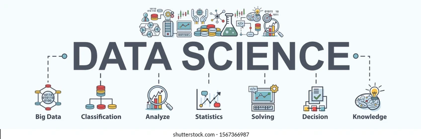

  

 

  

  <b>MCA Candidate • Data Analytics • Data Science • Machine Learning</b>

  
  
  
  

---

<h2>👨‍💻 About Me</h2>

<table>
<tr>

<td width="62%" valign="top">

<h3>👋 Who I Am</h3>

I am an <b>MCA candidate</b> focused on building my career in
<b>Data Analytics, Data Science and Machine Learning</b>.

I enjoy working with real-world datasets, discovering patterns,
performing exploratory analysis, creating meaningful visualizations
and developing data-driven solutions.

My background also includes experience in <b>React.js, Next.js and
web application development</b>, giving me an understanding of both
software development and data-driven problem solving.

<h3>🎯 Career Direction</h3>

<b>Data Analyst → Data Scientist → Machine Learning / AI Engineer</b>

</td>

<td width="38%" align="center">

  

<b>📊 Data</b> 
⬇  <b>🔎 Insights</b> 
⬇  <b>🤖 Machine Learning</b> 
⬇  <b>✨ AI</b>

</td>

</tr>
</table>

---

<h2>🧠 My Skill Journey</h2>

  

<table>
<tr>

<td width="33%" valign="top">

<h3>✅ Learned</h3>

<b>🐍 Programming</b>

<ul>
<li>Python</li>
<li>NumPy</li>
<li>Pandas</li>
</ul>

<b>📊 Analytics</b>

<ul>
<li>Data Cleaning</li>
<li>EDA</li>
<li>Data Visualization</li>
<li>Statistics Fundamentals</li>
</ul>

<b>🗄️ Database</b>

<ul>
<li>SQL</li>
<li>MySQL</li>
<li>Data Integration</li>
</ul>

<b>📈 Visualization</b>

<ul>
<li>Matplotlib</li>
<li>Seaborn</li>
<li>Tableau</li>
</ul>

</td>

<td width="33%" valign="top">

<h3>🟡 Currently Learning</h3>

<b>🤖 Machine Learning</b>

<ul>
<li>Regression</li>
<li>Classification</li>
<li>Clustering</li>
<li>Feature Engineering</li>
<li>Model Evaluation</li>
<li>Scikit-learn</li>
</ul>

<b>🧠 NLP</b>

<ul>
<li>Text Preprocessing</li>
<li>Tokenization</li>
<li>Feature Extraction</li>
<li>Text Classification</li>
</ul>

<b>🚀 Deployment</b>

<ul>
<li>FastAPI</li>
<li>REST APIs</li>
<li>Docker</li>
</ul>

</td>

<td width="33%" valign="top">

<h3>🚀 Future Learning</h3>

<b>🧠 Deep Learning</b>

<ul>
<li>Neural Networks</li>
<li>ANN</li>
<li>CNN</li>
<li>RNN</li>
</ul>

<b>✨ Generative AI</b>

<ul>
<li>LLMs</li>
<li>Prompt Engineering</li>
<li>Embeddings</li>
<li>Vector Databases</li>
</ul>

<b>🔎 Advanced AI</b>

<ul>
<li>RAG</li>
<li>LangChain</li>
<li>Semantic Search</li>
<li>AI Applications</li>
</ul>

</td>

</tr>
</table>

---

<h2>🛠️ Technical Skills</h2>

<h3>🐍 Programming & Data</h3>

<h3>📊 Data Visualization</h3>

<h3>🤖 Machine Learning</h3>

<h3>🌐 Development</h3>

---

<h2>📊 My Data Science Roadmap</h2>

<b>✅ Python</b>
 →  <b>✅ NumPy</b>
 →  <b>✅ Pandas</b>
 →  <b>✅ Data Cleaning</b>
 →  <b>✅ EDA</b>
 →  <b>✅ Visualization</b>
 →  <b>🟡 Statistics</b>
 →  <b>🟡 SQL</b>
 →  <b>🟡 Machine Learning</b>
 →  <b>🟡 NLP</b>
 →  <b>🚀 Deep Learning</b>
 →  <b>✨ GenAI</b>
 →  <b>🔎 LLMs & RAG</b>

  

---

<h2>🎓 Education</h2>

<table>

<tr>

<td width="75%" valign="top">

<h3>🎓 Master of Computer Applications (MCA)</h3>

<b>Amity University Online</b> 
2024 – 2026

  

📌 Focus: Data Science • Data Analytics • Machine Learning

</td>

<td width="25%" align="center">

<h2>📊</h2>

<b>First Division</b> 
~70%

</td>

</tr>

<tr>

<td valign="top">

<h3>🎓 Bachelor of Commerce (B.Com)</h3>

<b>Parishkar International College, Jaipur</b>

</td>

<td align="center">

📚 
Undergraduate

</td>

</tr>

<tr>

<td valign="top">

<h3>💻 Post Graduate Diploma in Computer Applications</h3>

<b>Maharishi Mahesh Yogi Vedic Vishwavidyalaya</b>

</td>

<td align="center">

💻 
PGDCA

</td>

</tr>

</table>

---

<h2>🚀 Featured Projects</h2>

<table>

<tr>

<td width="50%" valign="top">

<h3>🛒 E-Commerce Price & Product Intelligence</h3>

Scraped product listings for <b>price, rating, reviews and brand</b>;
cleaned the dataset and engineered a value-for-money score.
Built a Tableau dashboard to identify top brands, categories and
price-vs-rating patterns.

<b>🧰 Tech Stack</b>

</td>

<td width="50%" valign="top">

<h3>💼 Job Market & Salary Analytics</h3>

Scraped job postings for <b>title, salary, experience and skills</b>;
standardized titles and locations, engineered experience and
skill-count features, and analyzed salary and remote-work trends.

<b>🧰 Tech Stack</b>

</td>

</tr>

<tr>

<td width="50%" valign="top">

<h3>🏥 Healthcare & Hospital Operations Analytics</h3>

Cleaned patient admissions data covering <b>demographics, departments,
billing and length of stay</b>. Engineered age bands and cost categories
and created a Tableau dashboard for admissions, costs and diagnoses.

<b>🧰 Tech Stack</b>

</td>

<td width="50%" valign="top">

<h3>🤖 Employee Attrition Prediction</h3>

Analyzed employee data, performed <b>EDA and feature engineering</b>,
and developed machine learning models to study employee attrition
patterns and identify factors associated with employee turnover.

<b>🧰 Tech Stack</b>

</td>

</tr>

</table>

---

<h2>💼 Professional Experience</h2>

<table>

<tr>

<td width="75%" valign="top">

<h3>Frontend Web Developer — Kajkarma</h3>

<b>React.js • Next.js • REST APIs</b>

</td>

<td align="right">

<b>Aug 2025 – Mar 2026</b>

</td>

</tr>

<tr>

<td colspan="2">

Developed responsive web applications using React.js and Next.js,
working with reusable components, dynamic routing, API integration
and responsive UI development.

</td>

</tr>

<tr>

<td width="75%" valign="top">

<h3>PHP Developer Intern — Easy Dots Technologies</h3>

<b>PHP • Web Development</b>

</td>

<td align="right">

<b>Jan 2023 – Nov 2023</b>

</td>

</tr>

<tr>

<td colspan="2">

Worked on web application development, feature implementation,
debugging and application functionality.

</td>

</tr>

</table>

---

<h2>🏆 Certifications & Credentials</h2>

<table>

<tr>

<td width="50%" valign="top">

<h3>🐍 Python, MySQL, Data Science & Django</h3>

<b>EduxGain</b>

  

📅 Issued: Feb 2022 
🔑 <code>EGA201901477</code>

  

Python • MySQL • Data Science • Django

</td>

<td width="50%" valign="top">

<h3>💻 PHP Developer Internship</h3>

<b>Easy Dots Technologies Private Limited</b>

  

📅 Issued: Dec 2023 
🔑 <code>EASY / 2023-24/05</code>

  

PHP • Web Development

</td>

</tr>

<tr>

<td width="50%" valign="top">

<h3>💻 Rajasthan State Certificate in Information Technology</h3>

<b>Vardhman Mahaveer Open University, Kota</b>

  

📅 Issued: May 2021 
🔑 <code>0662192</code>

</td>

<td width="50%" valign="top">

<h3>🎓 Post Graduate Diploma in Computer Applications</h3>

<b>Maharishi Mahesh Yogi Vedic Vishwavidyalaya</b>

  

📅 Issued: Jan 2023 
🔑 <code>118210574</code>

</td>

</tr>

</table>

---

<h2>📚 Currently Learning</h2>

  

---

<h2>✨ Future: Generative AI</h2>

<table>

<tr>

<td width="25%" align="center">

<h3>🧠 Deep Learning</h3>

Neural Networks 
ANN 
CNN 
RNN 
Deep Learning Models

</td>

<td width="25%" align="center">

<h3>✨ GenAI</h3>

LLMs 
Prompt Engineering 
Embeddings 
AI APIs 
Generative Applications

</td>

<td width="25%" align="center">

<h3>🔎 RAG</h3>

Retrieval 
Vector Databases 
Semantic Search 
Document Q&A 
RAG Pipelines

</td>

<td width="25%" align="center">

<h3>⚙️ AI Engineering</h3>

LangChain 
FastAPI 
Docker 
Cloud 
MLOps

</td>

</tr>

</table>

---

<h2>🎯 Long-Term Vision</h2>

My goal is to continuously develop from a <b>Data Analytics</b> foundation into <b>Data Science, Machine Learning and Artificial Intelligence</b>,
while building practical, scalable and useful technology.

---

<h2>📈 GitHub Analytics</h2>

---

<h2>🐍 GitHub Contribution Activity</h2>

---

<h2>🌱 What I'm Building</h2>

<table>

<tr>

<td width="25%" align="center">

<h3>📊</h3>
<b>Analytics</b>

  

Real-world datasets 
EDA 
SQL 
Dashboards

</td>

<td width="25%" align="center">

<h3>🤖</h3>
<b>Machine Learning</b>

  

Feature Engineering 
Models 
Evaluation 
Prediction

</td>

<td width="25%" align="center">

<h3>✨</h3>
<b>Generative AI</b>

  

LLMs 
RAG 
Embeddings 
AI Applications

</td>

<td width="25%" align="center">

<h3>🚀</h3>
<b>Deployment</b>

  

FastAPI 
Docker 
Cloud 
MLOps

</td>

</tr>

</table>

---

<h2>📫 Let's Connect</h2>

 

  <b>⭐ Explore my repositories • Learn with me • Build with data</b>

